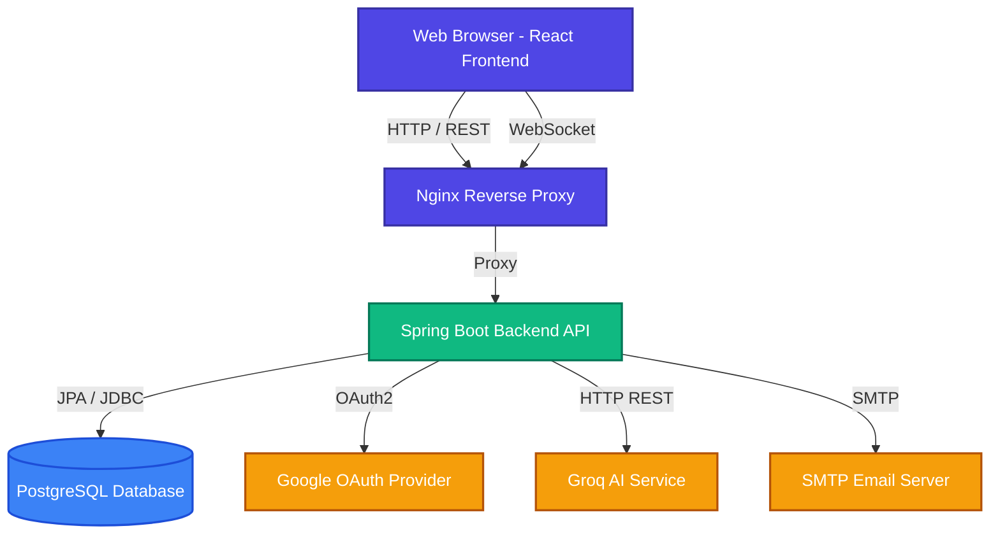
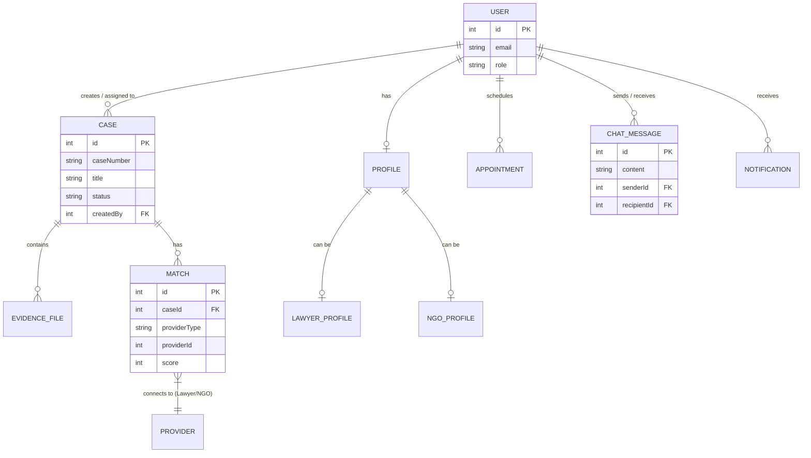

# Legal Aid Matching Assistant

A comprehensive platform designed to connect individuals in need of legal assistance with qualified pro-bono lawyers and non-governmental organizations (NGOs).

---

## 🛑 Problem Statement

Access to legal aid is often a complex, opaque, and intimidating process for marginalized or low-income individuals. People who need legal help struggle to find affordable or pro-bono representation, while lawyers and NGOs willing to offer such services often lack a centralized platform to discover, vet, and communicate with clients efficiently. This disconnect results in delayed justice and a widening justice gap.

## 💡 Solution

The **Legal Aid Matching Assistant** bridges this gap by providing a smart, centralized platform that seamlessly connects clients, lawyers, and NGOs. Key features include:

- **Smart Matching System:** Matches cases with the right legal providers based on expertise, location, and case priority.
- **Secure Communication:** Real-time chat functionality (WebSocket-based) for secure and immediate communication between matched parties.
- **AI-Powered Assistance:** Integration with Groq AI to assist users in drafting case descriptions and answering basic legal FAQs.
- **Case & Evidence Management:** Tools for users to upload evidence and manage the lifecycle of their case from submission to resolution.
- **Role-Based Access Control:** Distinct profiles and permissions for Clients, Lawyers, NGOs, and Administrators.

---

## 🏗 Architecture

The platform uses a modern, scalable client-server architecture:
- **Frontend (Client):** A dynamic Single Page Application (SPA) built with React. It communicates with the backend via RESTful APIs for standard operations and WebSockets for real-time chat.
- **Backend (Server):** A robust Java Spring Boot application that handles business logic, security, and integration with third-party services like Google OAuth and Groq AI.
- **Database:** PostgreSQL is used for reliable and structured data persistence.
- **Deployment:** The entire stack is containerized using Docker and orchestrated with Docker Compose, with Nginx serving the frontend and proxying API requests.

---

## 🛠 Tech Stack

### Frontend
- **Framework:** React 19
- **Routing:** React Router DOM
- **State Management:** Zustand
- **Styling:** TailwindCSS, PostCSS
- **Real-time:** SockJS, StompJS (WebSockets)
- **Maps & Data:** React Leaflet, Recharts

### Backend
- **Framework:** Java 21, Spring Boot 3.4
- **Database & ORM:** PostgreSQL, Spring Data JPA
- **Security:** Spring Security, JWT (JSON Web Tokens), Google OAuth2
- **Real-time:** Spring WebSocket
- **Monitoring & Rate Limiting:** Spring Boot Actuator, Micrometer Prometheus, Bucket4j, Caffeine Cache

### Infrastructure & External APIs
- **Containerization:** Docker, Docker Compose
- **Web Server:** Nginx
- **AI Integration:** Groq API
- **Email Service:** Spring Mail (SMTP)

---

## 📊 Architecture Diagram

---

## 🗄 Entity Relationship Diagram

Below is a simplified view of the core domain entities and their relationships.

